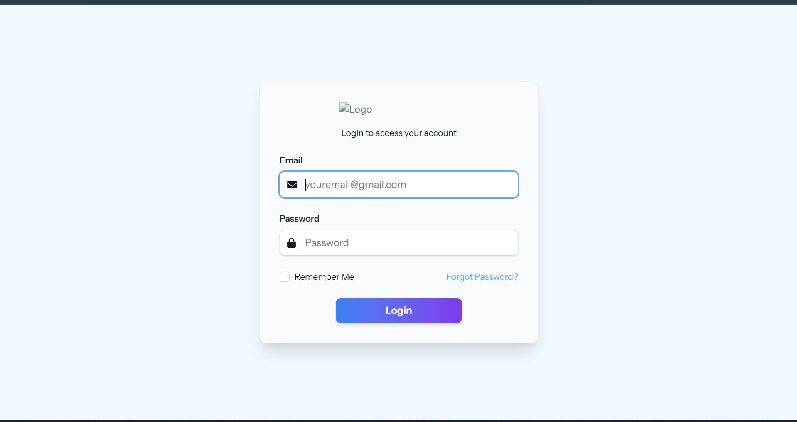

# Task Manager Sederhana


## Run Locally

Clone the project

```bash
  git clone https://github.com/ambsa/project-app.git
```

Go to the project directory

```bash
  cd project-app
```

Install dependencies

```bash
  npm install
```

Start the server

```bash
  npm run dev & php artisan serve
```


## Demo

http://localhost:8000/


## Screenshots




## Note

Ahmad Fatah Maulana
Membuat Task Manager sederhana
Mencatat setiap tugas yang diberikan serta memantau tugas tersebut dengan status yang belum, proses, atau selesai dikerjakan.
21/10/2025
23/10/2025